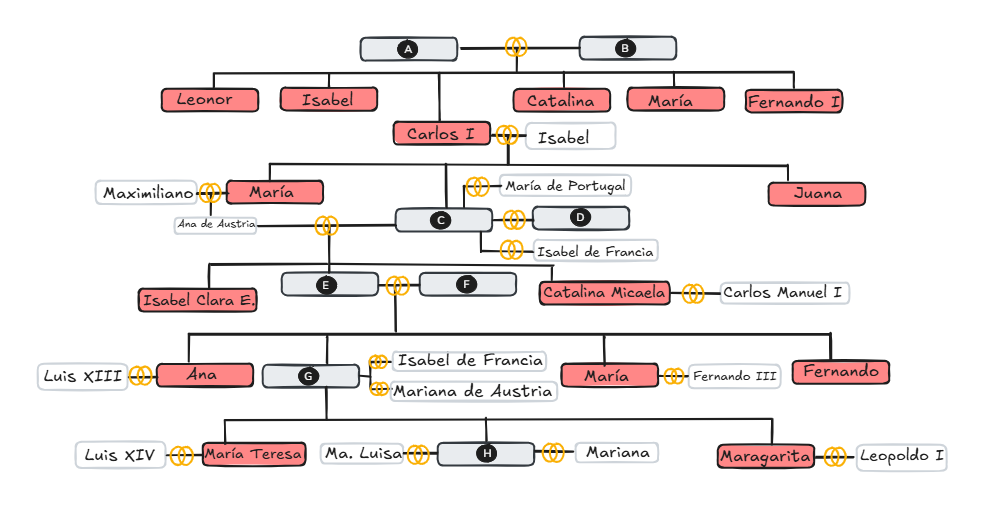
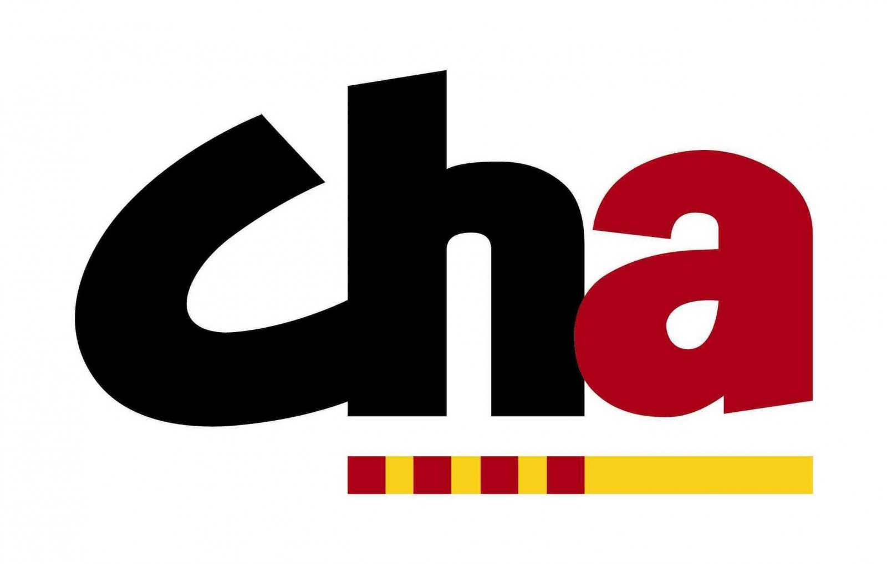
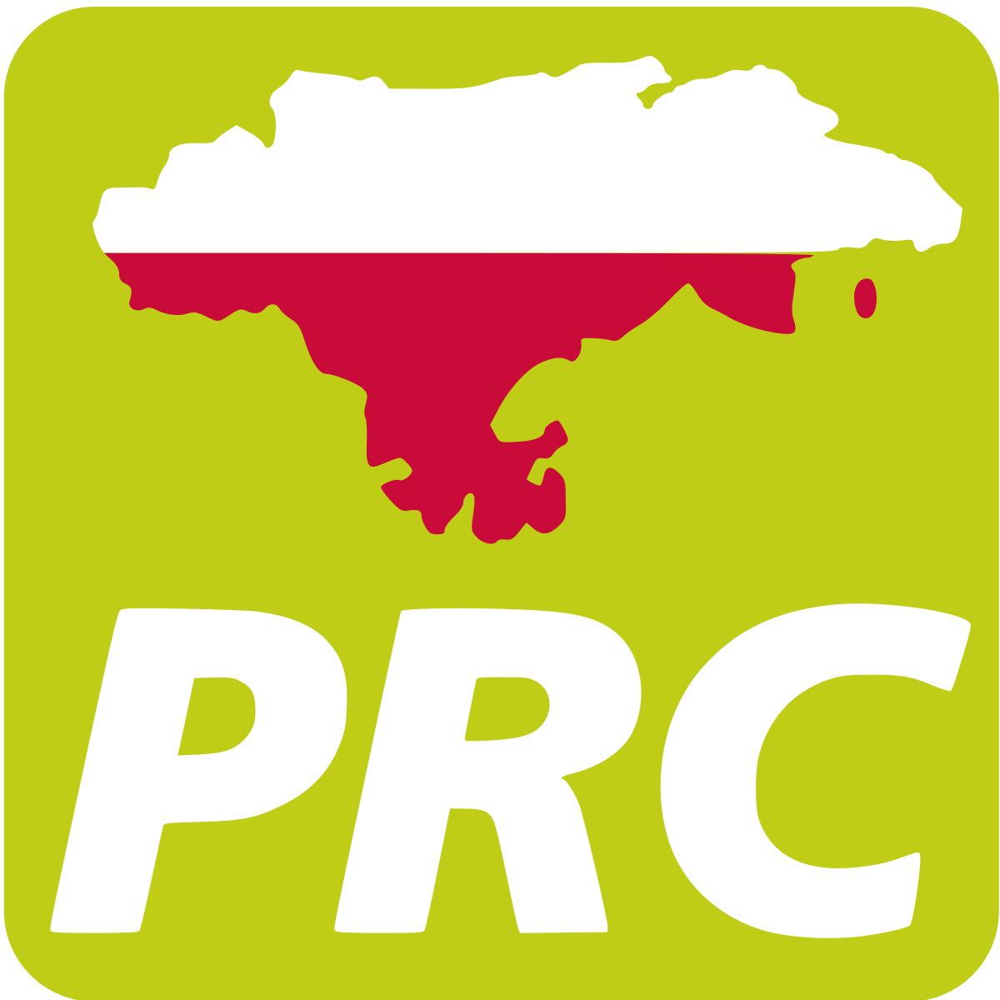
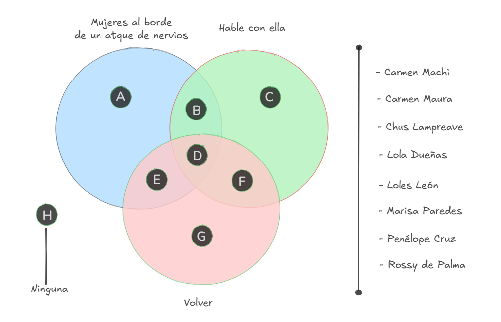
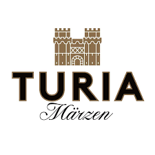
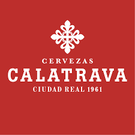
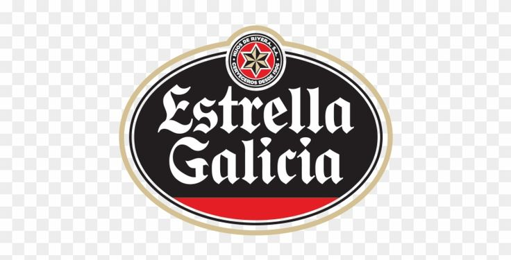
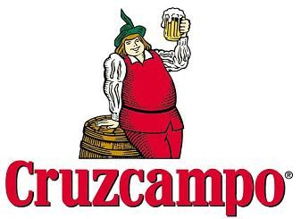
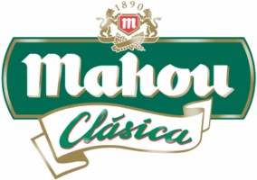

## **Tarjeta 001**
**Título:** PLAYAS     
**Consigna:** Identifique la playa según la zona  
**Descripción:** Mapa con puntos marcados en Donosti (A), Vigo (B), Santander (C), Cádiz (D), Valencia (E), Barcelona (F), Alicante (G) y Málaga (H).

**Opciones:**

El Sardinero / La Caleta / La Concha / La Malagueta / La Malvarrosa / Playa del Postiguet/ Samil / Somorrostro

**Respuestas:**

- A: La Concha - San Sebastián
- B: Samil - Vigo
- C: El Sardinero - Santander 
- D: La Caleta - Cádiz
- E: La Malvarrosa - Valencia
- F: Somorrostro - Barcelona
- E: Playa del Postiguet - Alicante
- F: La Malagueta - Málaga

---

## **Tarjeta 002**
**Título:** LOS AUSTRIAS     
**Consigna:** Indentifique los miembros de la casa real por relación de parentezco    
**Descripción:** Árbol genealógico de la casa de los Austrias con algunos nombres faltantes.

**Recursos:**  

- Borrar los nombres que figuran en las respuestas

**Respuestas:**

- A: Felipe I de Castilla "el Hermoso"
- B: Juana I de Castilla "la Loca"
- C: Felipe II "el Prudente"
- D: María Tudor "Bloody Mary"
- E: Felipe III "el Piadoso"
- F: Margarita de Austria
- G: Felipe IV "el Grande"
- H: Carlos II "el Hechizado"

---

## **Tarjeta 003**
**Título:** PARTIDOS POLÍTICOS     
**Consigna:** Indentifique el nombre del partido o federación autonómicos según su logo    
**Descripción:** Logos de partidos políticos autonómicos (ERC, CC, Compromís, PNV, CHA, Bildu, BNG, PRC).

**Recursos:**  

**Respuestas:**

- A: ERC (Esquerra Republicana de Catalunya)
- B: CC (Coalicion Canaria)
- C: Compromís
- D: PNV (Partido Nacionalista Vasco)
- E: CHA (Chunta Aragonesista)
- F: Junts per Catalunya
- G: BNH (Bloque Nacionalista Galego)
- H: PRC (Partido Regionalista de Cantabria)

---

## **Tarjeta 004**
**Título:** CHICAS ALMODÓVAR     
**Consigna:** Indentifique la actriz según la película  
**Descripción:** Esquema de intersección de círculos con películas.

**Recursos:**  

**Respuestas:**

- A: Rossy de Palma
- B: Loles León
- C: Carmen Machi
- D: Chus Lampreave
- E: Carmen Maura
- F: Lola Dueñas
- G: Penélope Crez
- H: Marisa Paredes
 
---

## **Tarjeta 005**
**Título:** COPA DEL REY  
**Consigna:** Ordene los equipos por número de copas  
**Descripción:** Prirámide o esquema de mayor a menor para ordenar por número de copas.

**Opciones:**  

Arenas de Getxo / Athletic Club / Deportivo La Coruña / Real Madrid / Real Unión / Sevilla / Valencia / Zaragoza

**Respuestas:**

- 24: Athletic Club
- 20: Real Madrid
-  8: Valencia
-  6: Zaragoza
-  5: Sevilla
-  3: Real Unión
-  2: Deportivo La Coruña
-  1: Arenas de Getxo

---

## **Tarjeta 006**
**Título:** MARISOL  
**Consigna:** Ordene las películas por año   
**Descripción:** Línea temporal con años marcados

**Opciones:**  

Bodas de sangre / Búsqueme a esa chica / Carola de día, Carola de noche / El poder del deseo / Marisol Rumbo a Río / Solo los dos / Tómbola / Un rayo de luz 

**Respuestas:**

- 1960: Un rayo de luz 
- 1962: Tómbola
- 1963: Marisol rumbo a Río
- 1964: Búsqueme a esa chica
- 1968: Solo los dos
- 1969: Carola de día, Carola de noche
- 1975: El poder del deseo
- 1981: Bodas de Sangre

---

## **Tarjeta 007**
**Título:** CERVEZAS  
**Consigna:** Indentifique la comunidad autónoma según su cerveza  
**Descripción:** Logos de cervezas.

**Recursos:**  

**Respuestas:**

- A: Valencia (Turia)
- B: Castilla La Mancha (Calatrava)
- C: Galicia (Estrella Galicia)
- D: Andalucía (Cruzcampo)
- E: Catalunya (Esrealla Damm)
- F: Comunidad de Madrid (Mahou)
- G: Aragón (Ámbar)
- H: Murcia (Estrella de Levante)

---

## **Tarjeta 008**
**Título:** PREMIOS GOYA  
**Consigna:** Ordene de mayor a menor las personas con más premios Goya  
**Descripción:** Nombres de personas con esquema de ordenamiento.

**Opciones:**  

ALEJANDRO AMENÁBAR / FERNANDO FERNÁN GÓMEZ / ISABEL COIXET / MARIBEL VERDÚ / PEDRO ALMODÓVAR / PENÉLOPE CRUZ / RODRIGO SOROGOYEN / VERÓNICA FORQUÉ

**Respuestas:**

- A: Pedro Almodóvar (10)
- B: Alejandro Amenábar (9)
- C: Isabel Coixet (8)
- D: Fernando Fernán Gómez (6)
- E: Rodrigo Sorogoyen (5)
- F: Verónica Forqué (4)
- G: Penélope Cruz (3)
- H: Maribel Verdú (2)

**NOTA:** Puede hacerse con películas, se desactualiza menos.

---