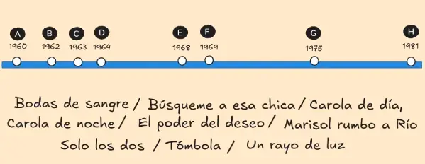
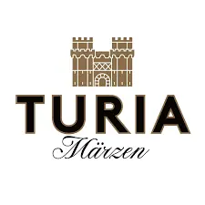
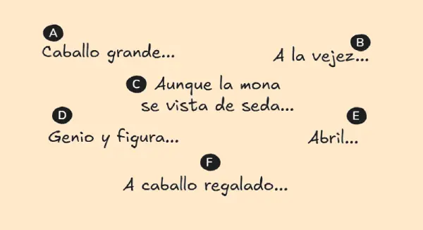

## **Tarjeta 001**
**Título:** PLAYAS     
**Consigna:** Identifique la playa según la zona  
**Descripción:** Mapa con puntos marcados en Donosti (A), Vigo (B), Santander (C), Cádiz (D), Valencia (E), Barcelona (F), Alicante (G) y Málaga (H).

**Opciones:**

El Sardinero / La Caleta / La Concha / La Malagueta / La Malvarrosa / Playa del Postiguet / Samil / Somorrostro

**Respuestas:**

- A: La Concha - San Sebastián
- B: Samil - Vigo
- C: El Sardinero - Santander 
- D: La Caleta - Cádiz
- E: La Malvarrosa - Valencia
- F: Somorrostro - Barcelona
- G: Playa del Postiguet - Alicante
- H: La Malagueta - Málaga

---

## **Tarjeta 002**
**Título:** LOS AUSTRIAS     
**Consigna:** Identifique los miembros de la casa real por relación de parentezco    
**Descripción:** Árbol genealógico de la casa de los Austrias con algunos nombres faltantes.

**Recursos:**  

**Respuestas:**

- A: Felipe I de Castilla "el Hermoso"
- B: Juana I de Castilla "la Loca"
- C: Felipe II "el Prudente"
- D: María Tudor "Bloody Mary"
- E: Felipe III "el Piadoso"
- F: Margarita de Austria
- G: Felipe IV "el Grande"
- H: Carlos II "el Hechizado"

---

## **Tarjeta 003**
**Título:** PARTIDOS POLÍTICOS     
**Consigna:** Identifique el nombre del partido o federación autonómicos según su logo    
**Descripción:** Logos de partidos políticos autonómicos (ERC, CC, Compromís, PNV, CHA, Bildu, BNG, PRC).

**Recursos:**  

  
  
  
  

  
  
  
  

**Respuestas:**

- A: ERC (Esquerra Republicana de Catalunya)
- B: CC (Coalicion Canaria)
- C: Compromís
- D: PNV (Partido Nacionalista Vasco)
- E: CHA (Chunta Aragonesista)
- F: Junts per Catalunya
- G: BNH (Bloque Nacionalista Galego)
- H: PRC (Partido Regionalista de Cantabria)

  
  
  
  

  
  
  
  

---

## **Tarjeta 004**
**Título:** CHICAS ALMODÓVAR     
**Consigna:** Identifique la actriz según la película  
**Descripción:** Esquema de intersección de círculos con películas.

**Recursos:**  

**Respuestas:**

- A: Rossy de Palma
- B: Loles León
- C: Carmen Machi
- D: Chus Lampreave
- E: Carmen Maura
- F: Lola Dueñas
- G: Penélope Crez
- H: Marisa Paredes

---

## **Tarjeta 005**
**Título:** COPA DEL REY  
**Consigna:** Ordene los equipos por número de copas  
**Descripción:** Prirámide o esquema de mayor a menor para ordenar por número de copas.

**Opciones:**  

Arenas de Getxo / Athletic Club / Deportivo La Coruña / Real Madrid / Real Unión / Sevilla / Valencia / Zaragoza

**Respuestas:**

- 24: Athletic Club
- 20: Real Madrid
-  8: Valencia
-  6: Zaragoza
-  5: Sevilla
-  3: Real Unión
-  2: Deportivo La Coruña
-  1: Arenas de Getxo

---

## **Tarjeta 006**
**Título:** MARISOL  
**Consigna:** Ordene las películas por año   
**Descripción:** Línea temporal con años marcados

**Opciones:**  

Bodas de sangre / Búsqueme a esa chica / Carola de día, Carola de noche / El poder del deseo / Marisol Rumbo a Río / Solo los dos / Tómbola / Un rayo de luz

**Respuestas:**

- 1960: Un rayo de luz 
- 1962: Tómbola
- 1963: Marisol rumbo a Río
- 1964: Búsqueme a esa chica
- 1968: Solo los dos
- 1969: Carola de día, Carola de noche
- 1975: El poder del deseo
- 1981: Bodas de Sangre

---

## **Tarjeta 007**
**Título:** CERVEZAS  
**Consigna:** Identifique la comunidad autónoma según su cerveza  
**Descripción:** Logos de cervezas.

**Recursos:**  

  
  
  
  

  
  
  
  

**Respuestas:**

- A: Comunitat Valenciana (Turia)
- B: Castilla-La Mancha (Calatrava)
- C: Galicia (Estrella Galicia)
- D: Andalucía (Cruzcampo)
- E: Catalunya (Estrella Damm)
- F: Comunidad de Madrid (Mahou)
- G: Aragón (Ámbar)
- H: Región de Murcia (Estrella de Levante)

---

## **Tarjeta 008**
**Título:** PREMIOS GOYA  
**Consigna:** Ordene de mayor a menor las personas con más premios Goya  
**Descripción:** Nombres de personas con esquema de ordenamiento.

**Opciones:**  

ALEJANDRO AMENÁBAR / FERNANDO FERNÁN GÓMEZ / ISABEL COIXET / MARIBEL VERDÚ / PEDRO ALMODÓVAR / PENÉLOPE CRUZ / RODRIGO SOROGOYEN / VERÓNICA FORQUÉ

**Respuestas:**

- A: Pedro Almodóvar (11)
- B: Alejandro Amenábar (9)
- C: Isabel Coixet (8)
- D: Fernando Fernán Gómez (6)
- E: Rodrigo Sorogoyen (5)
- F: Verónica Forqué (4)
- G: Penélope Cruz (3)
- H: Maribel Verdú (2)

**NOTA:** Puede hacerse con películas, se desactualiza menos.

---

## **Tarjeta 009**
**Título:** CIGARRILLOS     
**Consigna:** Identifique las marcas de tabaco  
**Descripción:** Dibujos de cajetillas de tabaco

**Recursos:**  

  
  
  
    

  
  
  
  

**Respuestas:**

- A: Bisonte
- B: Lucky Stblue
- 9: Nobel
- D: Winston
- E: Fortuna
- F: Ducados
- G: Camel
- H: L&M

  
  
  
  

  
  
  
  

---

## **Tarjeta 010**
**Título:** FRASES     
**Consigna:** Identifique la persona que dijo la frase    
**Descripción:** Seis globos con frases muy conocidas de personalidades o personajes mediáticos.

**Opciones:**

- A: "Yo he venido aquí a hablar de mi libro."
- B: "¡Dientes, dientes, que es lo que les jode!"
- C: "Si me queréis, irse."
- D: "Yo por mi hija MA-TO."
- E: "¿Por qué no te callas?"
- F: "En dos palabras: im-presionante."
- G: "¡Manda huevos!"
- H: "Siempre negativo, nunca positivo."

**Recursos:** 

**Respuestas:**

- A: Paco Umbral
- B: Lola Flores
- C: Isabel Pantoja
- D: Belén Esteban
- E: Juan Carlos de Borbón
- F: Jesulín de Ubrique
- G: Federico Trillo
- H: Louis Van Gaal

---

## **Tarjeta 011**
**Título:** LA MOVIDA     
**Consigna:** Identifique al artista según las canciones    
**Descripción:** Letras de canciones icónicas de "La Movida".

**Letras:**  

 - "Déjame, ya no tiene sentido
   Es mejor que sigas tu camino
   Que yo el mío seguiré"

 - "Hoy podrás beber y lamentar
   que ya no volverán
   sus alas a volar"

 - "Yo digo salta
   salta conmigo,
   digo salta
   salta conmigo"

 - "Te mataré con mis zapatos de claqué
    te asfixiaré con mi malla de ballet"

 - "Me asomo a la ventana eres la chica de ayer
    demasiado tarde para comprender"

 - "Hace falta valor, hace falta valor
    ven a la escuela de calor"

 - "La Luna llena sobre París
    ha transformado en hombre a Denis"

 - "Los bares, qué lugares tan gratos para conversar
    no hay como el calor del amor en un bar"

  

**Respuestas:**

- A: Los Secretos (tema: Déjame)
- B: Duncan Dhu (tema: 100 gaviotas)
- C: Tequila (tema: Salta)
- D: Siniestro Total (tema: Bailaré sobre tu tumba)
- E: Nacha Pop (tema: Chica de ayer)
- F: Radio Futura (tema: Escuela de calor)
- G: La Unión (tema: Lobo Hombre en París)
- H: Gabinete Caligari (tema: Al calor del amor en un bar)

Afuera: Alaska, Mecano, Hombres G

---

## **Tarjeta 12**
**Título:** VIRAL     
**Consigna:** Identifique el vídeo viral por su protagonista  
**Descripción:** Fotograma icónico de un video viral o su protagonista.

**Recursos:**  

  
  
  
  

  
  
  
  

**Respuestas:**

- A: La he liado parda
- B: Caranchoa
- C: Es mejor eso que morirse
- D: Droja en el cola-cao 
- E: Venga, venga... ¡que viene el fuego!
- F: Pim pam, toma Lacasitos
- G: Drogas en la UPV
- H: La que has liao, pollito 

---