# **El Ilustrado - Tarjetas de Presentación**

## **Tarjetas Celestes**

---

### **Tarjeta 001**
**Título:** ESPAÑA DE ORO  
**Consigna:** Ubica a los jugadores según los torneos que ganaron  
**Descripción:** Presentación de esquema de intersecciones entre tres torneos de fútbol ganados por España. 

**Esquema:** 
- A: Euro 2008  
- B: Euro 2008 y Mundial 2010 
- C: Mundial 2010 
- D: Euro 2008, Mundial 2010 y Euro 2012   
- E: Euro 2008 y Euro 2012  
- F: Mundial 2010 y Euro 2012 
- G: Euro 2012 
- H: Ninguno 

**Opciones:**
- Jordi Alba
- Santiago Cañizares
- Santi Cazorla
- Jesús Navas
- Andrés Palop
- Carles Puyol
- Fernando Torres
- Nadie ganó solo este/os torneo/s  

**Tarjeta - Frente:**  

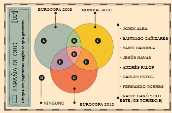

**Respuestas:**
- A: Andrés Palop  
- B: Carles Puyol  
- C: Nadie ganó solo esto
- D: Fernando Torres
- E: Santi Cazorla  
- F: Jesús Navas  
- G: Jordi Alba  
- H: Santiago Cañizares  

**Tarjeta - Dorso:**  

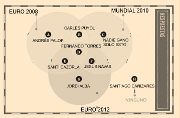

---

### **Tarjeta 002**
**Título:** SERIES MÍTICAS  
**Consigna:** Ordena las series según los años de emisión  
**Descripción:** Línea temporal de permanencia de ocho series.

**Esquema:**
- A: 1999-2009  
- B: 1999-2006  
- C: 2000-2012  
- D: 2001-2024  
- E: 2003-2008  
- F: 2005-2024
- G: 2005-2014   
- H: 2007-presente

**Opciones:**
- 7 vidas
- Aída
- Amar... (en tiempos revueltos + es para siempre)
- Cuéntame
- El comisario
- Hospital central
- La que se avecina
- Los Serrano   

**Tarjeta - Frente:**  

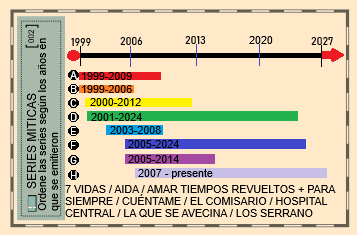

**Respuestas:**
- A: El comisario  
- B: 7 Vidas  
- C: Hospital central  
- D: Cuéntame  
- E: Los Serrano  
- F: Amar...
- G: Aída   
- H: La que se avecina  

**Tarjeta - Dorso:**  

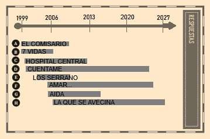

---

### **Tarjeta 003**
**Título:** OPERACIÓN TRIUNFO   
**Consigna:** Identifique la edición de OT de cada cantante    
**Descripción:** Retratos de cantantes de OT para asignar edición.

**Retratos:**
- A: Edurne  
- B: Alba Reche  
- C: Manu Carrasco  
- D: Chenoa  
- E: Chica Sobresalto  
- F: Pablo López
- G: Amaia   
- H: Samantha   

**Tarjeta - Frente:**  

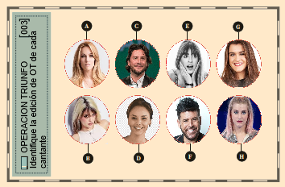

**Respuestas:**
- A: OT4  
- B: OT10
- C: OT2 
- D: OT1  
- E: OT11  
- F: OT8
- G: OT9   
- H: OT11   

**Tarjeta - Frente:**  

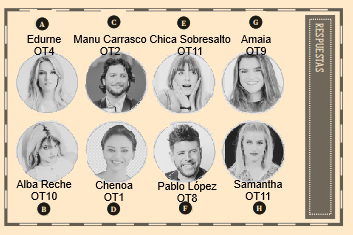

## **Tarjetas Rosas**

---

### **Tarjeta 001**
**Título:** ¿QUIÉN LO DIJO?     
**Consigna:** Identifique la persona que dijo la frase    
**Descripción:** Seis globos con frases muy conocidas de personalidades o personajes mediáticos.

**Opciones:**
- A: "Yo he venido aquí a hablar de mi libro."
- B: "Si me queréis, irse."
- C: "Yo por mi hija MA-TO."
- D: "¿Por qué no te callas?"
- E: "¿Dientes, dientes, que es lo que les jode!"
- F: "En dos palabras: im-presionante." 

**Tarjeta - Frente:**  

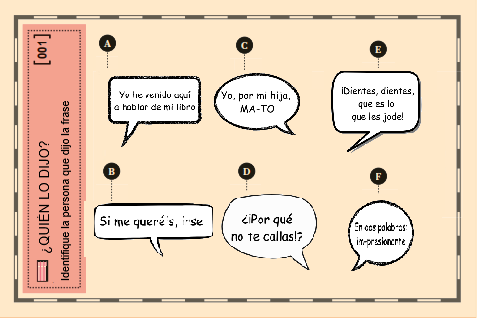

**Respuestas:**
- A: Paco Umbral
- B: Lola Flores
- C: Belén Esteban
- D: Juan Carlos de Borbón
- E: Isabel Pantoja
- F: Jesulín de Ubrique     

**Tarjeta - Dorso:**  

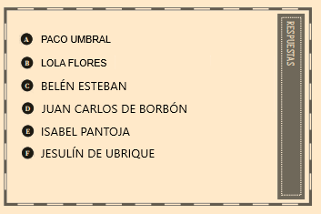

---

### **Tarjeta 002**
**Título:** LA CASA DE PAPEL    
**Consigna:** Identifique al actor o actriz según la ciudad que denomina su personaje    
**Descripción:** Imágenes icónicas de las ciudades del nombre los personajes.

**Gráficos:**
- A: Denver
- B: Helsinki
- C: Río de Janeiro
- D: Berlín
- E: Tokio
- F: Lisboa

**Tarjeta - Frente:**  
  
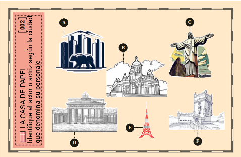

**Respuestas:**
- A: Denver - Jaime Lorente
- B: Helsinki - Darko Perić
- C: Río de Janeiro - Miguel Herrán
- D: Berlín - Pedro Alonso
- E: Tokio - Úrsula Corberó
- F: Lisboa - Itziar Ituño

**Tarjeta - Dorso:**  

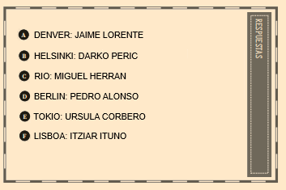

---

### **Tarjeta 003**
**Título:**  TELEVISIÓN AUTONÓMICA      
**Consigna:** Indentifique los canales autonómicos según su logo    
**Descripción:** Logos de los canales autonómicos.

**Logos:**   
- A: TV3
- B: ETB
- C: Canal Sur
- D: À Punt
- E: TVG
- F: Telemadrid 

**Respuestas:**
- A: TV3 - Catalunya
- B: ETB - Euskadi
- C: Canal Sur - Andalucía
- D: À Punt - Comunitat Valenciana
- E: TVG - Galicia
- F: Telemadrid - Comunidad de Madrid

**Tarjeta - Frente:**  

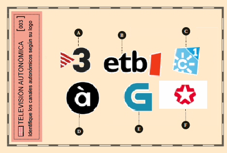

**Respuestas:**

**Tarjeta - Dorso:**  

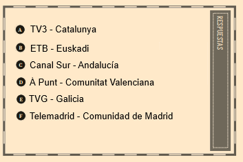

---

