# **El Ilustrado - Tarjetas de Presentación**

## **Tarjeta 001**
**Título:** FRASES     
**Consigna:** Identifique la persona que dijo la frase    
**Descripción:** Seis globos con frases muy conocidas de personalidades o personajes mediáticos.

**Opciones:**

- A: "Yo he venido aquí a hablar de mi libro."
- B: "¡Dientes, dientes, que es lo que les jode!"
- C: "Si me queréis, irse."
- D: "Yo por mi hija MA-TO."
- E: "¿Por qué no te callas?"
- F: "En dos palabras: im-presionante." 

**Recursos:** 

**Respuestas:**

- A: Paco Umbral
- B: Lola Flores
- C: Isabel Pantoja
- D: Belén Esteban
- E: Juan Carlos de Borbón
- F: Jesulín de Ubrique

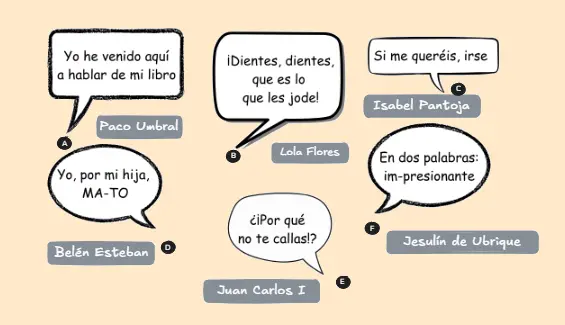
---

## **Tarjeta 002**
**Título:** TELEVISIÓN AUTONÓMICA      
**Consigna:** Identifique la cadena según su logo    
**Descripción:** Logos de los canales autonómicos.

**Recursos:**   

**Respuestas:**

- A: TV3 - Catalunya
- B: ETB - Euskadi
- C: Canal Sur - Andalucía
- D: À Punt - Comunitat Valenciana
- E: TVG - Galicia
- F: Telemadrid - Comunidad de Madrid

---

## **Tarjeta 003**
**Título:** PROGRAMAS DEL CORAZÓN      
**Consigna:** Identifique el programa según el presentador o presentadora    
**Descripción:** Retratos de presentadores y presentadoras.
*webp

  
  
  

  
  
  

**Respuestas:**

- A: D corazón - Anne Igartiburu
- B: Dónde estás corazón - Jaime Cantizano
- C: Sálvame - Jorge Javier Vázquez
- D: Qué me dices - Antonio Botella "Chapis" 
- E: Salsa Rosa - Santi Acosta
- F: Extra Rosa - Ana Rosa Quintana

---

## **Tarjeta 004**
**Título:** LA MOVIDA     
**Consigna:** Identifique al artista según las canciones    
**Descripción:** Letras de canciones icónicas de "La Movida".

**Letras:**  

 - "Déjame, ya no tiene sentido
   Es mejor que sigas tu camino
   Que yo el mío seguiré"

 - "Hoy podrás beber y lamentar
   que ya no volverán
   sus alas a volar"

 - "Yo digo salta
   salta conmigo,
   digo salta
   salta conmigo"

 - "Te mataré con mis zapatos de claqué
    te asfixiaré con mi malla de ballet"

 - "Me asomo a la ventana eres la chica de ayer
    demasiado tarde para comprender"

 - "Hace falta valor, hace falta valor
    ven a la escuela de calor"

**Respuestas:**
webp
- A: Los Secretos (tema: Déjame)
- B: Duncan Dhu (tema: 100 gaviotas)
- C: Tequila (tema: Salta)
- D: Siniestro Total (tema: Bailaré sobre tu tumba)
- E: Nacha Pop (tema: Chica de ayer)
- F: Radio Futura (tema: Escuela de calor)

Afuera: Alaska, Mecano, La Unión, Hombres G

---

## **Tarjeta 005**
**Título:** PASTA DE DIENTES     
**Consigna:** Identifique la pasta dental por su envase    
**Descripción:** Dibujos de tubos de pasta dental.

**Recursos:**  

  
  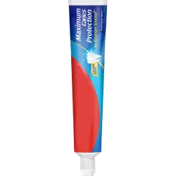
  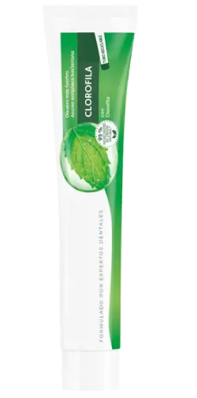

  
  
  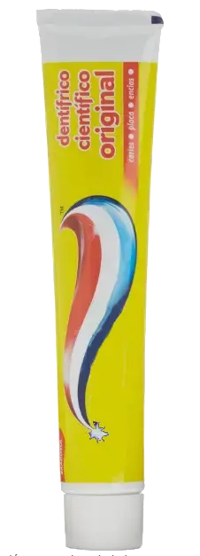

**Respuestas:**

- A: Oral-B
- B: Colgate
- C: Licor del polo
- D: Signal
- E: Sensodyne
- F: Binaca

  
  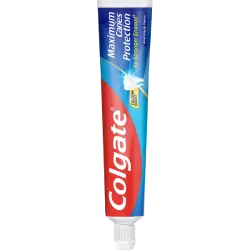
  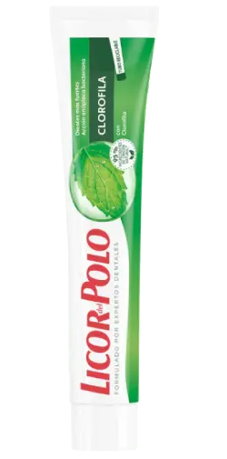

  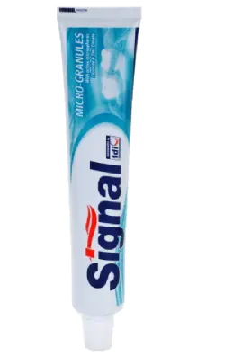
  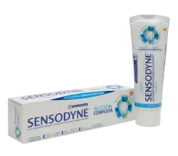
  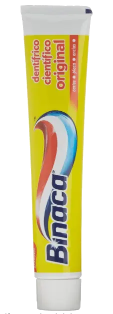

**Alterntivas:** Lacer, Fluocaril, Elmex, Parodontax

---

## **Tarjeta 006**
**Título:** OSCARIZADOS     
**Consigna:** Identifique la persona que ganó un premio Oscar según la película    
**Descripción:** Póster de 6 películas y nombres de personas.

**Recursos:**  

  
  
  

  
  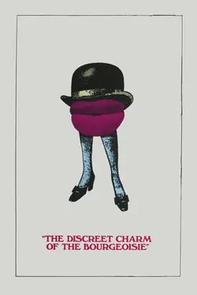
  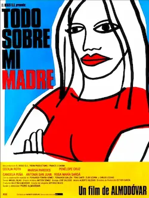

**Respuestas:**

- A: Penélope Cruz
- B: Fernado Trueba
- C: Alejandro Amenábar
- D: Javier Bardem
- E: Luis Buñuel
- F: Pedro Almodóvar

---

## **Tarjeta 007**
**Título:** MARCAS BLANCAS     
**Consigna:** Relacione la marca blanca con el supermercado   
**Descripción:** Logos de supermercados y nombres de marcas blancas.

**Recursos:**  

  
  
  

  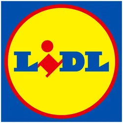
  
  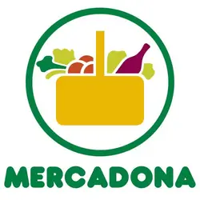

**Opciones:**

ALIADA / AUCHAN / BONTÉ / EROSKI / HACENDADO / MILBONA

**Respuestas:**

- A: Auchan - Alcampo
- B: Aliada - El Corte Inglés
- C: Bonté - Dia
- D: Milbona - Lidl
- E: Eroski - Eroski
- F: Hacendado - Mercadona

  
  
  

  
  
  

---

## **Tarjeta 008**
**Título:** CIGARRILLOS     
**Consigna:** Identifique las marcas de tabaco  
**Descripción:** Dibujos de cajetillas de tabaco

**Recursos:**  

  
  
  

  
  
  

**Respuestas:**

- A: Bisonte
- B: Lucky Strike
- C: Nobel
- D: Winston
- E: Fortuna
- F: Ducados

  
  
  

  
  
  

---

## **Tarjeta 009**
**Título:** CARRETERAS     
**Consigna:** Identifique la autovía radial por su punto de llegada  
**Descripción:** Mapa de la red de autovías radiales, o líneas rectas si se busca sumar dificulatad. (Reemplazar en el dibujo los nombres de las autovías y añadir las ciudades destino)

**Opciones:**

A1 / A2 / A3 / A4 / A5 / A6

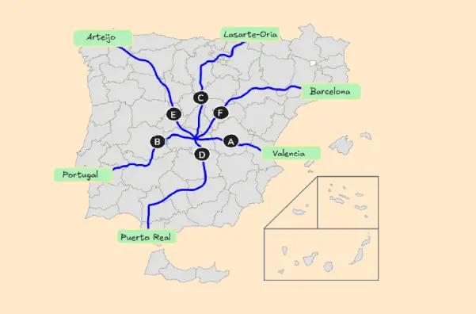

**Respuestas:**

- A: A3 . Valencia
- B: A5 - Portugal
- C: A1 - Lasarte / Oria
- D: A4 - Puerto Real
- E: A6 - Arteijo
- F: A2 - Barcelona

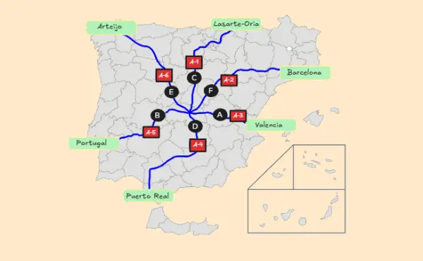

---

## **Tarjeta 010**
**Título:** LECHES     
**Consigna:** Identifique la leche por su envase    
**Descripción:** Dibujos de las marcas de leches más conocidas.

**Recursos:**  

  
  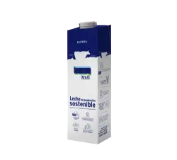
  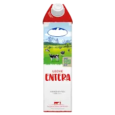

  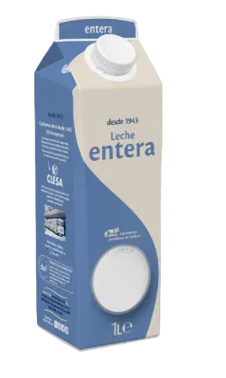
  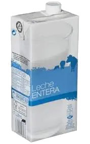
  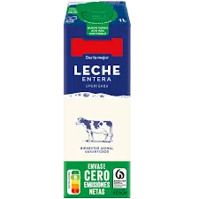

**Respuestas:**

- A: Puleva
- B: Kaiku
- C: Central Lechera Asturiana
- D: Clesa
- E: Hacendado
- F: Pascual

  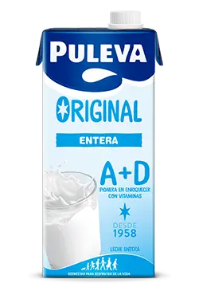
  
  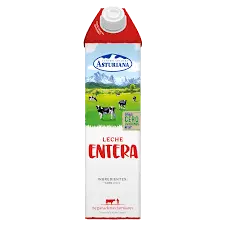

  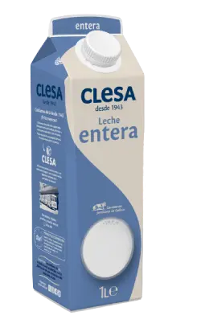
  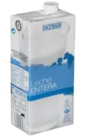
  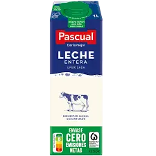

**Alternativas:** El Buen Pastor, Leyma, Ato, Celta, Llet Nostra

---

## **Tarjeta 11**
**Título:** SIGLO DE ORO   
**Consigna:** Identifique el autor de la abra.    
**Descripción:** Retratos (con el nombre) de poetas del siglo de Oro y título de las obras como opciones.

**Opciones:**

Don Quijote de la Mancha / El Lazarillo de Tormes / Fuenteovejuna / La vida es sueño / Primero sueño / Soledades 

**Recursos:**  

  
  
  

  
  
  

**Respuestas:**

- A: La vida es sueño
- B: Don Quijote de la Mancha
- C: El Lazarillo de Tormes
- D: Soledades
- E: Primero Sueño
- F: Fuenteovejuna

**Alternativa:**

**NOTA:** puede pasar celeste con estos cambios:
 - agregando a Francisco de Quevedo (La vida del Buscón) y Garcilaso de la Vega (Obras de Juan Borcán y [autor])
 - ajustando dificultad de Crevantes (Novelas ejemplares) y Lope (El caballero de Olmedo)

---

## **Tarjeta 12**
**Título:** VIRAL     
**Consigna:** Identifique el vídeo viral por su protagonista  
**Descripción:** Fotograma icónico de un video viral o su protagonista.

**Recursos:**  

  
  
  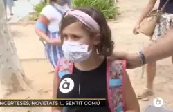

  
  
  

**Respuestas:**

- A: La he liado parda
- B: Caranchoa
- C: Es mejor eso que morirse
- D: Droja en el cola-cao 
- E: Venga, venga... ¡que viene el fuego!
- F: Pim pam, toma Lacasitos

---

## **Tarjeta 013**
**Título:** CAMPANADAS  
**Consigna:** Identifique a la persona con quien presentó las campanadas  
**Descripción:** Nombre de una de las parejas del dúo y otra faltante.

 
**Opciones:**

- A: Raffaella Carrà (R. G.)
- B: Jesús Vázquez (P. P)
- C: Cristina Pedroche (A. C.)
- D: Lalachus (D. B)
- E: Dani Mateo (C. P.)
- F: Roberto Leal (A. I)

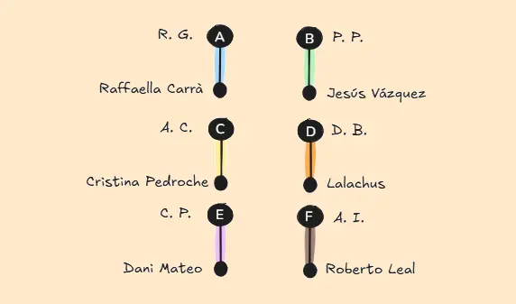

**Respuestas:**

- A: Ramón García
- B: Paz Padilla
- C: Alber
- D: David Broncano
- E: Cristina Pardo
- F: Anne Igartiburu

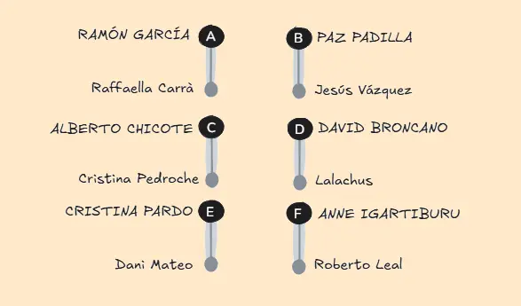

---

## **Tarjeta 014**
**Título:** REFRANES  
**Consigna:** Complete el refrán  
**Descripción:** Refranes con una parte faltante.

**Opciones:**

- A: "Caballo grande..."
- B: "A la vejez..."
- C: "Aunque la mona se vista de seda..."
- D: "Genio y figura..."
- E: "Abril..."
- F: "A caballo regalado..."

**Respuestas:**

- A: "...ande o no ande"
- B: "
- C: "...mona se queda"
- D: "...hasta la sepultura"
- E: "...luvias mil"
- F: "...No le mires el diente"

**Alternativas:** (dejadas fuera con dolor)

- "Hay más días --- que longanizas"
- "Oveja que bala --- bocado que pierde"
- "Libro cerrado --- no saca letrado"
- "Quien a buen árbol se arrima --- buena sombra le cobija"
- "Santa Rita Rita --- lo que se da no se quita"
- "Tanto va el cántaro a la fuente --- que al final se rompe"
- "Haz el bien --- y no mires a quién"
- "Muerto el perro --- se acabó la rabia"
- "Nunca es tarde --- si la dicha es buena"

---

## **Tarjeta 015**
**Título:** NOMBRES QUE RIMAN  
**Consigna:** Identifique el nombre en la rima popular  
**Descripción:** Expresiones humorísticas porpulares con el nombre faltante.

**Opciones:**

- A: "Qué nivel,..."
- B: "A saco..."
- C: "Repelente, niño..."
- D: "Por el interés te quiero..."
- E: "Qué risa, tía..."
- F: "En fin..."

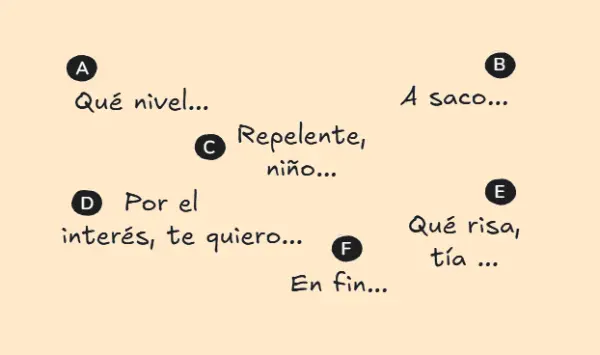

**Respuestas:**

- A: "Maribel"
- B: "Paco"
- C: "Vicente"
- D: "Andrlisa"
- F: "Serafín"

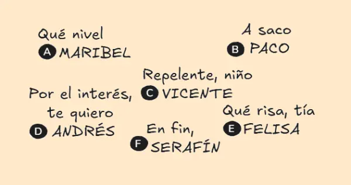

---